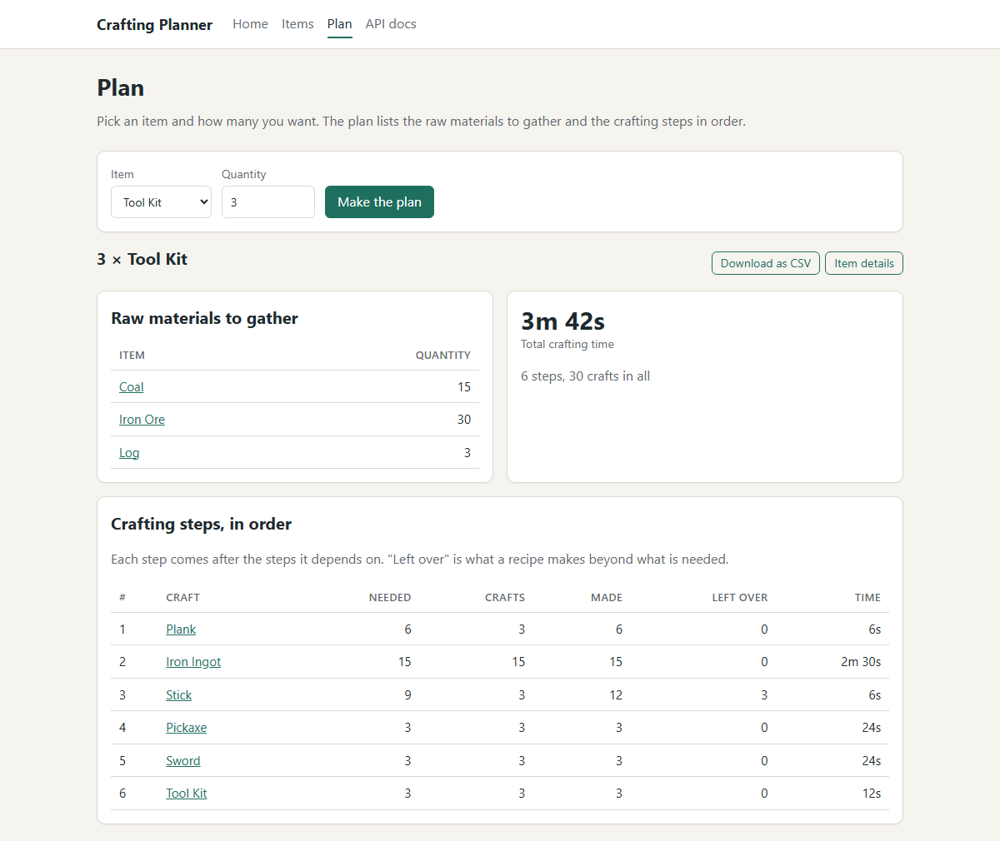
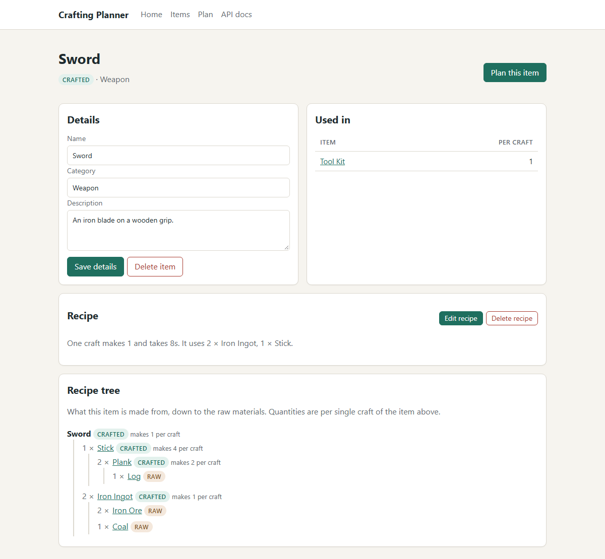

# Crafting Planner

Crafting Planner answers one question: **to make N of this item, what raw materials do I need?**

Items are made from other items, which are made from other items. The app stores items and recipes, and works out the totals. It is a C# web API with a website on top, built as a full stack exercise.

The crafting theme is inspired by games such as Minecraft. The same logic is used in manufacturing, where it is called a bill of materials.



## Status

| Stage | Delivers | State |
|---|---|---|
| 1 | Project skeleton, database, Items API, interactive API page | Done |
| 2 | Recipes and ingredients API, all data rules | Done |
| 3 | Planning calculation, with automated tests | Done |
| 4 | Recipe tree, summaries, export | Done |
| 5 | Website | Done |
| 6 | Endpoint tests, data dictionary, demo script | Next |

## Run it

You need the [.NET 10 SDK](https://dotnet.microsoft.com/download). Nothing else: the database is a single file that the app creates on first run, with sample data included.

```
dotnet run --project src/CraftingPlanner.Api
```

Then open <http://localhost:5080>.

| Address | What it is |
|---|---|
| <http://localhost:5080> | The website: plan an item, manage items and recipes |
| <http://localhost:5080/swagger> | The interactive API page: try every endpoint from the browser |

To start again with fresh sample data, stop the app and delete `src/CraftingPlanner.Api/craftingplanner.db`.

## Run the tests

```
dotnet test
```

The tests hold the planning calculation to the worked example in the design document and to cases that catch specific mistakes, and cover the tree builder, chain depths, and the CSV export. The same calculation cases are run against the Python prototype with `py prototype/test_plan.py`.

## The website

Plain HTML, CSS, and JavaScript, served by the same app. Every page reaches the backend only through the API, so the browser's network panel shows the same calls the interactive API page makes.

| Page | What it does |
|---|---|
| Home | Totals, the most used ingredient, the longest recipe chain, and the way in to each page |
| Plan | Pick an item and a quantity. Get the raw materials, the crafting steps in order, the total time, and a CSV download |
| Items | Search, filter, sort, and page through items. Add and delete items |
| Item | Edit an item's details, create or edit its recipe, see what it is used in, and view its recipe tree |

Rejections from the API appear on the page in plain words. Try giving Planks a recipe that uses Sticks, and the page explains the loop.



## Try these on the API page

On the interactive API page, open an endpoint, choose **Try it out**, then **Execute**.

| Try | What it shows |
|---|---|
| `GET /api/items` with `kind` set to `crafted` | Filtering |
| `GET /api/items/9` | An item with its recipe and everything it is used in |
| `POST /api/items` with a new name | Insert |
| `PATCH /api/items/{id}` with only a category | Partial update |
| `POST /api/items` with the name `stick` | A rejection: the name is taken |
| `DELETE /api/items/9` | A rejection: other recipes depend on the item |
| `GET /api/recipes` with `uses` set to `9` | Every recipe that needs a Stick |
| `PUT /api/recipes/2/ingredients/1` with a quantity | Adding one ingredient to a recipe |
| `PUT /api/recipes/1/ingredients/9` with a quantity | A rejection: Planks made from Sticks would loop, because Sticks are made from Planks |
| `GET /api/items/18/plan` with `quantity` set to `3` | Everything it takes to make three Tool Kits, and the order to craft it in |
| `GET /api/items/18/plan/export` with `quantity` set to `3` | The same plan as a file that opens in a spreadsheet |
| `GET /api/items/11/tree` | The Sword's recipe drawn as a tree, down to the raw materials |
| `GET /api/stats` | Totals, the most used ingredient, and the longest recipe chain |

## Documentation

| Document | Contents |
|---|---|
| [Design document](docs/DESIGN.md) | Requirements, data model, rules, and the reasons behind each decision |
| [API guide](docs/API-GUIDE.md) | Every operation with an example request and response |
| Interactive API page | Live reference, generated from the comments in the code |

Every public class, function, and field in the C# code has a structured comment, and the build fails if one is missing. Every function in the website's JavaScript has one too.

## Layout

```
docs/                        Design document, API guide, screenshots
prototype/                   The planning calculation in Python, written before the C# version
tests/CraftingPlanner.Tests/ Automated tests
src/CraftingPlanner.Api/
  Program.cs                 Startup: registers the parts and the request pipeline
  Controllers/               The endpoints
  Contracts/                 The shapes of requests and responses
  Services/                  Logic that needs no database or web: the loop search, the planning
                             calculation, the tree builder, chain depths, and the CSV writer
  Models/                    The database tables, described as classes
  Data/                      Database connection, table rules, sample data, shared queries
  wwwroot/                   The website: pages, stylesheet, and scripts
  CraftingPlanner.Api.http   Ready-made requests for editors that support them
```
