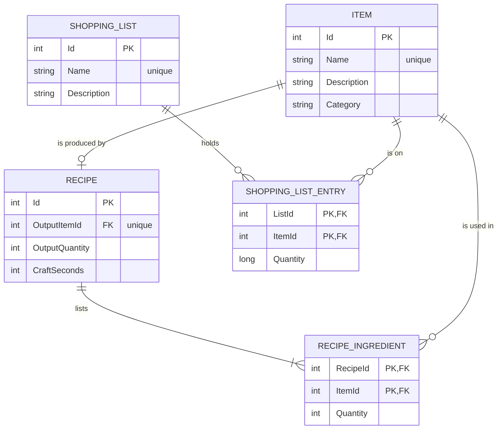

# Crafting Planner: Design Document

| | |
|---|---|
| **Status** | Written before any code on 2026-09-28. Updated during the build as decisions were made; each addition is marked with its reason. All six planned stages are complete |
| **Date** | 2026-09-28, last updated 2026-09-30 |
| **Stack** | C# on .NET 10, ASP.NET Core Web API, SQLite, plain HTML and JavaScript |

## 1. Purpose

Crafting Planner answers one question: **"To make N of this item, what raw materials do I need?"**

Items are made from other items, which are themselves made from other items. Working out the total by hand is slow and error prone, especially when a recipe makes several units at a time or when two parts of a build share a component. The app stores items and recipes, then does that calculation on request.

The crafting theme is inspired by games such as Minecraft, where tools are built from layers of simpler items. The same problem appears in manufacturing, where it is called a bill of materials, and the logic is the same. The sample data uses generic item names and none of any game's artwork or branding.

## 2. Requirements

### Must have

| # | Requirement |
|---|---|
| M1 | Store items and recipes in a database |
| M2 | Create, read, update, and delete items and recipes through a web API |
| M3 | Calculate the raw materials, crafting steps, and leftovers for any item and quantity |
| M4 | Refuse invalid data with a clear reason, including recipes that would loop |
| M5 | A website that uses the API for everything it shows and changes |
| M6 | Documentation for every endpoint, class, function, and data field |
| M7 | Runs on a reviewer's machine with one command and no database setup |
| M8 | Automated tests for the calculation and the endpoints |

### Nice to have

| # | Requirement |
|---|---|
| N1 | Stock on hand, so the plan can answer "what am I still missing?" |
| N2 | A craft action that uses up stock and adds the finished item |
| N3 | A hosted live demo |

### Added after the planned stages

Three additions were made after stage 6, each as its own pull request, to make the website feel like a finished product rather than a demonstration. Each is described where it belongs below and marked "added after stage 6".

| Addition | Why |
|---|---|
| Item pictures | A list of names reads as a database; a list of pictures reads as a product |
| An item picker with search and category chips | Dropdowns give no way to narrow by category and do not scale |
| Saved lists of items to make, planned together | The question "what do I need for all of this?" is the real one; a one-item plan only answers part of it |

### Deliberately left out

| Left out | Reason |
|---|---|
| Logins and user accounts | Adds a large amount of code that does not demonstrate the core problem |
| More than one recipe per item | Choosing between recipes is an optimization problem, which is a separate project |
| Byproducts (a recipe that makes two different things) | Complicates the calculation without adding a new idea |
| Fractional quantities | Whole numbers keep the rounding exact and avoid decimal errors |
| Several people editing at once | The app is a single-user demo |

## 3. Data model

The two shopping list tables were added after stage 6.

| Table | Field | Type | Rules |
|---|---|---|---|
| Item | Id | whole number | Set by the database |
| Item | Name | text | Required, unique, 1 to 80 characters |
| Item | Description | text | Optional, up to 500 characters |
| Item | Category | text | Optional, up to 40 characters, used for filtering |
| Item | Icon | text | Optional, up to 40 characters. Names one of the pictures the website ships with (added after stage 6, see section 7) |
| Recipe | Id | whole number | Set by the database |
| Recipe | OutputItemId | whole number | Required, must be an existing item, one recipe per item |
| Recipe | OutputQuantity | whole number | 1 to 1,000. How many units one craft makes |
| Recipe | CraftSeconds | whole number | 0 to 86,400, which is one day. Time for one craft |
| RecipeIngredient | RecipeId, ItemId | whole numbers | Together they identify the row, so an item appears once per recipe |
| RecipeIngredient | Quantity | whole number | 1 to 1,000. Units used by one craft |
| ShoppingList | Id | whole number | Set by the database |
| ShoppingList | Name | text | Required, unique, 1 to 80 characters |
| ShoppingList | Description | text | Optional, up to 500 characters |
| ShoppingListEntry | ListId, ItemId | whole numbers | Together they identify the row, so an item appears once per list |
| ShoppingListEntry | Quantity | whole number | 1 to 1,000,000. Units to make |

**Raw or crafted is never stored.** An item is raw when it has no recipe. Working this out on request means the label can never disagree with the data.

## 4. Rules the backend enforces

| Rule | Response when broken |
|---|---|
| Required fields present, values within range | 400 Bad Request |
| Every ingredient refers to an existing item | 400 Bad Request |
| A recipe is created with 1 to 20 ingredients, each item listed once | 400 Bad Request |
| Item names are unique | 409 Conflict |
| An item has at most one recipe | 409 Conflict |
| A recipe cannot need its own output, directly or through other recipes | 409 Conflict, showing the loop |
| A recipe's only ingredient cannot be removed | 409 Conflict |
| A recipe with 20 ingredients cannot take another | 409 Conflict |
| An item used as an ingredient cannot be deleted | 409 Conflict, listing the recipes that use it |
| The item or recipe in the address exists | 404 Not Found |
| Plan quantity is between 1 and 1,000,000 | 400 Bad Request |
| Every total in a plan fits in a 64-bit whole number | 400 Bad Request, naming the item |
| List names are unique | 409 Conflict |
| A list holds at most 50 items | 409 Conflict |
| An item on a list exists; a list in the address exists | 404 Not Found |

Every rejection uses the same standard error format (Problem Details), with a short title, a plain explanation, and the field at fault where one applies.

### Decisions behind the rules

| Decision | Reason |
|---|---|
| Looping recipes are refused when saved, not when planning | The calculation can then trust the data, and the person who made the mistake is told immediately |
| Deleting an in-use item is blocked, not cascaded | Cascading would silently break every recipe that depends on it |
| Deleting an item also deletes its own recipe | A recipe has no meaning without the item it makes |
| 400 means the request itself is wrong; 409 means it clashes with existing data | Callers can tell "fix your input" apart from "the data has to change first" |
| The item a recipe makes cannot be changed | Changing it would turn one item raw and another crafted in a single step. Deleting the recipe and creating a new one makes both effects visible |
| Deleting a recipe keeps the item it made | Other recipes may use that item as an ingredient. It becomes raw, and they keep working |
| The loop search uses a queue, not a function that calls itself | A long chain of recipes cannot crash the app by nesting calls too deeply |
| The loop search visits the nearest items first | The loop reported to the caller is the shortest one, which is the easiest to understand and fix |
| A recipe has at most 20 ingredients | Keeps one request from creating an unreasonable amount of work |
| A recipe tree stops at 2,000 nodes and marks what it left out | A tree repeats shared items, so a wide, deep set of recipes could make one that is far too large to send or draw. Growing it level by level puts the cut at the deepest levels, where it matters least |
| An item's icon must be one of the pictures the website ships with, listed by `GET /api/icons` | The API refuses a name with no file behind it, so the website never shows a broken picture. The list comes from the files on disk, so adding an icon file is all it takes to offer a new one |
| Deleting an item removes it from every list, rather than being blocked as it is for recipes | A recipe missing an ingredient is wrong data; a list missing an entry is still a valid list. The item page says how many lists an item is on before it is deleted |
| Planning a list and planning one item share one calculation and one assembly function | Two paths to the same numbers cannot disagree. A list's entries become the calculation's targets; a single item is a list of one |
| At startup, the app compares the database file with the code and stops with a plain message if a column is missing | Tables are created on first run but never altered. When the Icon column was added, an older file would otherwise fail on the first request with a database error. A deployed app would use migrations instead; this check is the honest stand-in for a project with no deployed database |
| The plan export is one table with a Type column | A single table opens cleanly in any spreadsheet program. Two tables in one file do not |

## 5. The planning calculation

### Steps

1. Collect every item the target depends on, at any depth.
2. Put them in an order where each item comes before its own ingredients.
3. Set the target's demand to the requested quantity.
4. Go through the items in order. For each crafted item:
   - crafts needed = demand divided by units per craft, rounded up
   - add (crafts needed x ingredient quantity) to each ingredient's demand
5. Items with no recipe are raw materials. Their demand is the final answer.

The ordering in step 2 guarantees that when an item is reached, everything that uses it has already been processed, so its demand is complete.

### Worked example

| Item | Made per craft | Ingredients per craft |
|---|---|---|
| Tool Kit | 1 | 1 Sword, 1 Pickaxe |
| Sword | 1 | 2 Iron Ingot, 1 Stick |
| Pickaxe | 1 | 3 Iron Ingot, 2 Stick |
| Iron Ingot | 1 | 2 Iron Ore, 1 Coal |
| Stick | 4 | 2 Plank |
| Plank | 2 | 1 Log |

**Plan for 3 Tool Kits:**

| Item | Needed | Crafts | Made | Left over |
|---|---|---|---|---|
| Tool Kit | 3 | 3 | 3 | 0 |
| Sword | 3 | 3 | 3 | 0 |
| Pickaxe | 3 | 3 | 3 | 0 |
| Iron Ingot | 15 | 15 | 15 | 0 |
| Stick | 9 | 3 | 12 | 3 |
| Plank | 6 | 3 | 6 | 0 |

**Raw materials: 30 Iron Ore, 15 Coal, 3 Log.**

### Key decision: total the demand before rounding

Sticks are needed by both the Sword and the Pickaxe. There are two ways to handle that, and they give different answers.

For 1 Tool Kit, which needs 3 Sticks in total (1 for the Sword, 2 for the Pickaxe):

| Approach | Stick crafts | Planks | Logs |
|---|---|---|---|
| Round each branch separately | 2 | 4 | 2 |
| **Total first, then round (chosen)** | 1 | 2 | 1 |

Rounding each branch separately makes 8 Sticks when 4 would do, and doubles the Logs. The chosen approach is why step 2 orders the items first: it is what makes a correct total possible.

### Limits

Totals use 64-bit whole numbers, and the plan quantity is capped at 1,000,000. That is enough for any realistic data, but not for every possible data set: a chain of recipes that each need 1,000 of the next exceeds 64 bits within six levels. So the arithmetic is checked, and a plan whose totals would not fit is refused with a 400 response that names the item, rather than silently returning a wrong number.

### Implementation notes

The calculation was written in Python first (`prototype/plan.py`), then translated to C# (`PlanCalculator`). Both are checked against the same cases. They differ in one deliberate way: the prototype builds its order with a function that calls itself, which is the most natural way to write it, while the C# version counts users with a queue, so a very long chain of recipes from user data cannot exhaust the stack. The loop search makes the same choice for the same reason.

## 6. API

All addresses start with `/api`. Requests and responses use JSON.

### Items

| Method | Address | Purpose |
|---|---|---|
| GET | `/items` | List items. Filter by search text, category, or kind (raw or crafted). Sort and page |
| GET | `/items/{id}` | One item, with its recipe and the recipes that use it |
| POST | `/items` | Create an item |
| PUT | `/items/{id}` | Replace every field of an item |
| PATCH | `/items/{id}` | Change only the fields that are sent |
| DELETE | `/items/{id}` | Delete an item and its own recipe |

### Recipes

| Method | Address | Purpose |
|---|---|---|
| GET | `/recipes` | List recipes. Filter by an ingredient they use |
| GET | `/recipes/{id}` | One recipe with its ingredients |
| POST | `/recipes` | Create a recipe together with its ingredients |
| PUT | `/recipes/{id}` | Replace a recipe and its ingredients |
| DELETE | `/recipes/{id}` | Delete a recipe. Its item becomes raw |

### Ingredients, nested inside a recipe

| Method | Address | Purpose |
|---|---|---|
| GET | `/recipes/{id}/ingredients` | List a recipe's ingredients |
| PUT | `/recipes/{id}/ingredients/{itemId}` | Add an ingredient, or change its quantity |
| DELETE | `/recipes/{id}/ingredients/{itemId}` | Remove an ingredient |

### Icons

| Method | Address | Purpose |
|---|---|---|
| GET | `/icons` | The pictures an item can be given, with their authors |

### Lists (added after stage 6)

| Method | Address | Purpose |
|---|---|---|
| GET | `/lists` | List the shopping lists, with how many items each holds |
| GET | `/lists/{id}` | One list with everything on it |
| POST | `/lists` | Create an empty list |
| PUT | `/lists/{id}` | Rename a list or change its note |
| DELETE | `/lists/{id}` | Delete a list. The items on it are not affected |
| PUT | `/lists/{id}/items/{itemId}` | Put an item on the list, or change its quantity |
| DELETE | `/lists/{id}/items/{itemId}` | Take an item off the list |
| GET | `/lists/{id}/plan` | What it takes to make everything on the list |
| GET | `/lists/{id}/plan/export` | The same as a CSV file |

### Planning and summaries

| Method | Address | Purpose |
|---|---|---|
| GET | `/items/{id}/plan?quantity=N` | Raw materials, crafting steps, leftovers, and total time |
| GET | `/items/{id}/plan/export?quantity=N` | The same plan as a downloadable shopping list (CSV) |
| GET | `/items/{id}/tree` | The item's recipe tree, for display |
| GET | `/stats` | Totals across the data: item, recipe, and category counts, the most-used ingredient, and the longest recipe chain |

### Operation coverage

| Operation type | Where it appears |
|---|---|
| Create, read, update, delete | Items and recipes |
| Partial update | `PATCH /items/{id}` |
| Filter, search, sort, paging | `GET /items`, `GET /recipes` |
| Nested records | Ingredients inside recipes |
| Calculation | Plan and tree |
| Summary | Stats |
| Rejection | Every rule in section 4 |
| Export | Plan export |
| State-changing action | Craft (nice to have N2) |

## 7. Website

Four pages of plain HTML, CSS, and JavaScript, served by the same app from its `wwwroot` folder.

| Page | Purpose | API it uses |
|---|---|---|
| Home | Totals and highlights, and the way in to each page | Stats |
| Plan | Pick an item with the picker and a quantity; show the raw materials, the steps in order, the total time; download as CSV | Items list, plan, export |
| Items | Search, filter by category or by whether an item has a recipe, sort, and page; add an item | Items |
| Item | Edit details and picture; create, edit, or delete the recipe, adding ingredients with the picker; see what the item is used in and which lists it is on; view the recipe tree | Items, recipes, tree, icons |
| Lists (added after stage 6) | Every saved list with its item count; create and delete | Lists |
| List (added after stage 6) | The items on one list with editable quantities, the picker to add more, and the plan for everything on it, redrawn after every change; rename, delete, download | Lists, list entries, list plan, export |

### The item picker (added after stage 6)

Wherever a page needs the person to choose an item, it shows the same picker: a search box, a row of category chips, and the matching items with a button on each. It replaced plain dropdowns, which do not scale past a few dozen items and give no way to narrow by category. The picker filters in the browser from the full item list, which is right for hundreds of items; at thousands it would ask the API to search instead, and the list endpoint already supports that.

### Rules the pages follow

| Rule | Reason |
|---|---|
| Every page reaches the backend only through the API, via one shared `request` function | The website is a client like any other. A reviewer can watch its calls in the browser's network panel and see the same requests the API page makes |
| Rejections from the API are shown on the page as they arrive: title, explanation, and the fields at fault | The backend is the single source of the rules. The pages do not repeat them, so they cannot drift from them |
| Text goes into the page through `textContent`, never `innerHTML` | An item name can never be mistaken for HTML |
| No framework and no build step | A reviewer runs one command and reads plain files. The trade-off, more hand-written code than a framework would need, is acceptable at four pages |
| Colours are defined once as variables, with a second set for dark mode | The site follows the reader's system setting without any extra code |
| Every JavaScript function has a structured comment | The same documentation standard as the C# code |
| Deleting happens only on an item's own page, never from a list row | A destructive button belongs where the full picture is visible: what the item is used in, and which lists it is on |
| The pages never show the words "raw" and "crafted"; an item with a recipe carries a small "recipe" tag, and the filter asks "has a recipe?" | The fact underneath is whether a recipe exists, and saying so plainly avoids jargon. The API keeps `kind` with those two values, documented as exactly that fact |
| Category is chosen from the categories in use, and typing one offers the existing names | Keeps spelling consistent without making categories a separate record to manage |
| The Items list reloads as the search text or a filter changes, after a short pause for typing | No "apply" step to forget. The pause keeps the API from being asked on every keystroke |

### Item pictures (added after stage 6)

Each item can carry an icon, chosen from a set of pictures shipped in the website's `icons` folder. They come from [game-icons.net](https://game-icons.net) under the Creative Commons Attribution 3.0 license; the authors are credited on the Home page and in `icons/LICENSE.md`. The files are single-colour SVGs used as masks, so one file follows the page's text colour in both light and dark mode. An item with no icon of its own shows a faint default for its category.

## 8. Technology choices

| Choice | Reason |
|---|---|
| .NET 10 | Current long-term support release |
| ASP.NET Core with controllers | One class per resource, the most widely used structure in C# teams |
| Entity Framework Core | Standard C# database library. Tables are described as C# classes |
| SQLite | The database is one file. A reviewer installs nothing |
| Plain HTML and JavaScript, served by the same app | No build tools. Shows the API calls directly, with nothing hidden by a framework |
| Calculation kept separate from the database and the web layer | It can be tested on its own with plain inputs and outputs |
| Database tables are created at startup if missing | There is no deployed database to upgrade, so versioned schema changes (migrations) would add files without adding value. They are the first change to make before a real deployment |
| Plain HTTP on the local machine | Avoids certificate prompts for the reviewer. A hosted version would use HTTPS |
| xUnit for tests | Standard C# test library |

## 9. Documentation standard

| Layer | Standard |
|---|---|
| C# code | Every public class, function, and field has a structured comment. The build fails if one is missing |
| Interactive API page | Generated from those comments. Each endpoint shows inputs, an example, and its possible rejections |
| API guide | Copy-and-paste examples for each operation, plus the error format |
| Data dictionary | Every table and field with type, meaning, and rules |
| Front end code | Every JavaScript function has a structured comment |
| README | What the app is, how to run it, and a short tour |
| This document | Requirements, decisions, and reasons, updated when a decision changes |

## 10. Build stages

Each stage ends with something that runs, and with its documentation complete.

| Stage | Delivers |
|---|---|
| 1 | Project skeleton, database, Items API, interactive API page |
| 2 | Recipes and ingredients API, all rules from section 4 |
| 3 | Planning calculation: Python prototype first, then the C# version and the plan endpoint, with automated tests holding both to the same answers |
| 4 | Tree, stats, and export |
| 5 | Website, as described in section 7 |
| 6 | Tests of the endpoints themselves, data dictionary, walkthrough, final README |
| 7 | Optional: stock on hand, craft action, hosted demo |

## 11. Future work

- Stock on hand and the craft action, if not completed in stage 7
- Several recipes per item, with a choice of cheapest or fastest
- Byproducts
- Logins, so each person has their own items
- Undo for deletions
